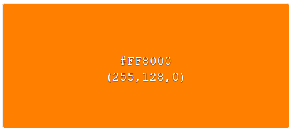
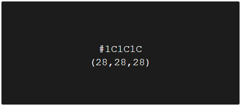
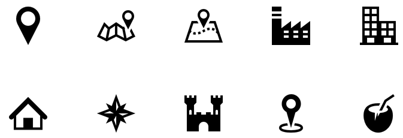
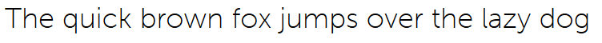

# Purrhub

Página web que muestra los conciertos y eventos musicales que se celebrarán en sevilla en las próximas fechas, permite registrarse para buscar conciertos personalizados con facilidad y añadirlos a favoritos.

### Modelado de usuarios:

**¿Quiénes son los usuarios?**

Aficionados a la música, principalmente, gente de entre 20 y 30 años.

**¿Cuáles son sus tareas y metas?**

- Metas:

  - Saber qué conciertos y eventos hay previstos en las próximas fechas.
  - Conocer la hora y el lugar de su celebración.
  - Recibir información de un tipo de evento en concreto.
  - Obtener información de las formas de adquirir la entrada y su precio.

- Tareas:

  - Proporcionar los datos correspondientes al registro.

**¿Qué nivel de experiencia tienen los usuarios?**

Saben moverse correctamente por una web al ser gente joven acostumbrada a utilizar redes sociales u otras páginas similares.

**¿Qué funciones se necesitan?**

- Registro/login.
- Búsqueda.
- Filtros para la búsqueda.
- Añadir conciertos a favoritos.
- Marcar un concierto si se ha adquirido la entrada.

**¿Qué información necesitan los usuarios?**

Información general acerca de los conciertos celebrados en sevilla, la información debe ser muy visual y concisa, de forma que en una misma página puedan ver varios de los conciertos celebrados con la información básica relevante: grupo, precio, ubicación y fecha.

**¿Cuáles son los casos más adversos?**

Los casos más adversos serían las fechas cercanas a conciertos, ya que mucha gente se informa y compra la entrada en el último momento.

### Interfaz:

### Principios de diseño:

- Principio de continuidad. (Conciertos en la página inicial)

- Principio de la proximidad. (Información de los conciertos)

- Principio de simplicidad. (Página principal)

### Principios de usabilidad principales:

- Control y libertad del usuario. (Al seleccionar conciertos)
- Consistencia y estándares. (Interfaz de la página)
- Prevención de errores. (Etiquetas en la búsqueda)
- Reconocimiento antes que recuerdo. (Iconos)

### Colores:

Los colores principales de la página web serán gris oscuro y naranja, colores seguros que no difieren mucho de un navegador a otro.

### Iconos:

Los iconos se usarán principalmente para favorecer el principio de usabilidad 'Reconocimiento antes que recuerdo'. Se usarán iconos con licencia gratuita, y tendrán un diseño minimalista acorde con la web.

### Imágenes:

Para el diseño de la web se utilizarán imágenes de conciertos, para cada concierto se utilizarán imágenes del grupo, que suelen tener en sus propias páginas web.

### Tipografía:

La fuente que utilizará la página será 'Museo Sans' dado que es una letra simple, bonita y gratuita:

### Webmaster-guidelines:

- Página responive.
- Utilizar el atributo "alt" en las imágenes.
- Evitar contenido pirateado en la página web.
- Optimizar la carga de la página utilizando herramientas como PageSpeed Insights.

