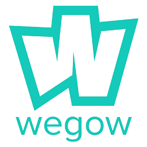

# Trabajo Interfaces Web

## Introducción:

Página web de conciertos y eventos musicales en sevilla.

- Conciertos.
- Eventos.
- Gestión de entradas.

## Análisis del diseño web:

### Introducción:

**Nombre: **Wegow

**URL de la página:** https://www.wegow.com/

**Logo principal:** 

**Tema principal de la página:** Página web de conciertos y venta de entradas.

## Bases de la web:

### Nombre: 

Purrhub

### Logo:

### Tema principal:

Página web que muestra los conciertos y eventos musicales que se celebrarán en sevilla en las próximas fechas, permite registrarse para buscar conciertos personalizados con facilidad y añadirlos a favoritos.

Se realizará la página web porque considero que es una aplicación útil, a diferencia de otras páginas, está será bastante simple de manejar y permitirá a los usuarios asignar etiquetas a los conciertos que describan cómo son.

### Modelado de usuarios:

**¿Quiénes son los usuarios?**

Aficionados a la música, principalmente, gente de entre 20 y 30 años.

**¿Cuáles son sus tareas y metas?**

- Metas:
  - Saber qué conciertos y eventos hay previstos en las próximas fechas.
  - Conocer la hora y el lugar de su celebración.
  - Recibir información de un tipo de evento en concreto.
  - Obtener información de las formas de adquirir la entrada y su precio.
- Tareas:
  - Proporcionar los datos correspondientes al registro.

**¿Qué nivel de experiencia tienen los usuarios?**

Saben moverse correctamente por una web al ser gente joven acostumbrada a utilizar redes sociales u otras páginas similares.

**¿Qué funciones se necesitan?**

- Registro/login.
- Búsqueda.
- Filtros para la búsqueda.
- Añadir conciertos a favoritos.
- Marcar un concierto si se ha adquirido la entrada.

**¿Qué información necesitan los usuarios?**

Información general acerca de los conciertos celebrados en sevilla, la información debe ser muy visual y concisa, de forma que en una misma página puedan ver varios de los conciertos celebrados con la información básica relevante: grupo, precio, ubicación y fecha.

**¿Cómo se espera que funcione?**

El tiempo de respuesta debe ser corto, la gente va a mirar los conciertos y hará click en varios de los conciertos para ver información más detallada así que las páginas deben cargar rápidamente.

**¿Cuáles son los casos más adversos?**

Los casos más adversos serían las fechas cercanas a conciertos, ya que mucha gente se informa y compra la entrada en el último momento.

**¿Se realizarán varias tareas a la vez?**

En principio no.

### Interfaz:

### Principios de diseño:

- Principio de continuidad:

  Los conciertos se mostrarán de forma ordenada como si de una cuadrícula se tratase.

- Principio de la proximidad:

  Toda la información acerca de los conciertos se encontrará modularizada en un mismo cuadrado.

- Principio de simplicidad:

  Se pretende que la página donde se muestran los conciertos sea simple y propicie los datos necesarios de forma concisa, sin más distracciones para el usuario.

### Principios de usabilidad principales:

- Control y libertad del usuario:

  Permitir al usuario volver al inicio donde están todos los conciertos con un simple click y fácilmente, sin que el usuario pueda perderse por la página buscando más información acerca de un concierto.

- Consistencia y estándares:

  El inicio de la página estará muy estandarizado, siguiendo la disposición común de este tipo de páginas para que el usuario sepa moverse por ella nada más entrar.

- Prevención de errores:

  Sugerir etiquetas o datos concretos que el usuario puede introducir en la búsqueda avanzada.

- Reconocimiento antes que recuerdo:

  Utilizar muchos iconos dentro de la descripción de un concierto para que el usuario sepa que es cada cosa de forma fácil.

### Colores:

Los colores principales de la página web serán gris oscuro y naranja, colores seguros que no difieren mucho de un navegador a otro. Se han elegido estos colores porque son una combinación bonita, el naranja es un color cálido que transmite alegría y buen humor, dándole a la página un toque acogedor y las sensación de buen rollo y energía que es habitual en los conciertos.

### Iconos:

Los iconos se usarán principalmente para favorecer el principio de usabilidad 'Reconocimiento antes que recuerdo'. Se usarán iconos con licencia gratuita, y tendrán un diseño minimalista acorde con la web.

### Imágenes:

Para el diseño de la web se utilizarán imágenes de conciertos, para cada concierto se utilizarán imágenes del grupo, que suelen tener en sus propias páginas web. Para las imágenes de los grupos se utilizarán presumiblemente .jpg para aligerar la carga de la web, pero también se utilizarán algunas imágenes .png con motivo decorativo para la página.

### Maquetación:

Se utilizarán divs y flexbox para la maquetación de la página y CSS3 y bootstrap para hacerla visualmente atractiva.

### Tipografía:

La fuente que utilizará la página será 'Museo Sans' dado que es una letra simple, bonita y gratuita:

### Webmaster-guidelines:

- Página responsive:

  Se hará la página responsive para que pueda ser visualizada en distintos dispositivos, recurriendo a características de CSS3.

- Utilizar el atributo "alt" en las imágenes:

  Se añadirá un texto alternativo a las imágenes para hacer la página más accesible a personas discapacitadas.

- Evitar contenido pirateado en la página web:

  Cercionarse de utilizar sólamente imágenes de grupos libre de licencia o derechos de autor.

- Optimizar la carga de la página utilizando herramientas como PageSpeed Insights:

  Utilizar este tipo de herramientas para ver cuánto tarda en cargar nuestra página y como podemos mejorar la carga.

### Conclusiones:

La página pretende ser sencilla y fácil de usar a la vez que útil y atractiva, recurriendo a un buen diseño de la web que agrade a los usuarios.